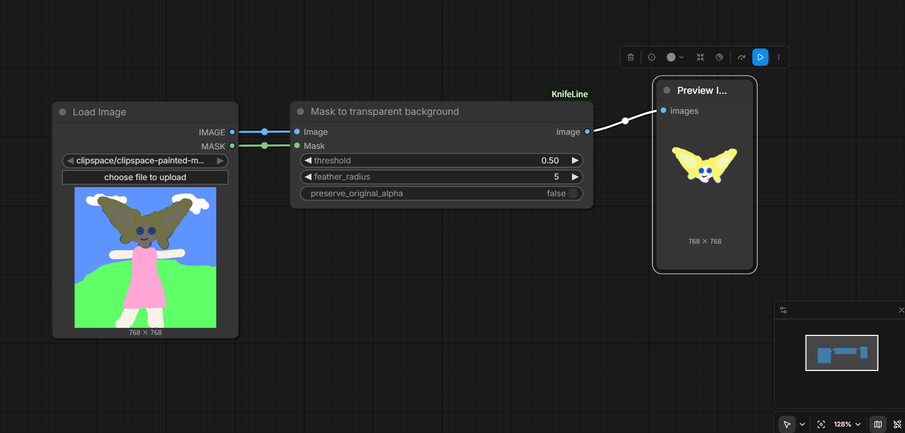

# ComfyUI-MaskToTransparent

一个用于 ComfyUI 的蒙版抠图工具，一键将蒙版黑色区域转为透明，支持边缘羽化，配合 SAM3.1 模型可快速实现目标提取与背景去除。



## ✨ 功能特性
ComfyUI 蒙版抠图便捷工具
- ✅ 蒙版黑色区域自动透明、白色完整保留原图
- ✅ 自定义边缘高斯羽化，消除生硬锯齿
- ✅ 支持原图Alpha通道保留/覆盖双模式
- ✅ RGB/RGBA图像兼容
- ✅ 常用于搭配 SAM3.1模型节点对图片进行语义分割后，只提取分割出来的目标物体，去掉图片中和目标物体不想关的其他像素内容。

## 📥 安装方式
1.  进入 ComfyUI 目录的 `custom_nodes` 文件夹
2.  执行命令：
    ```bash
    git clone https://github.com/Warningning/ComfyUI-MaskToTransparent.git
